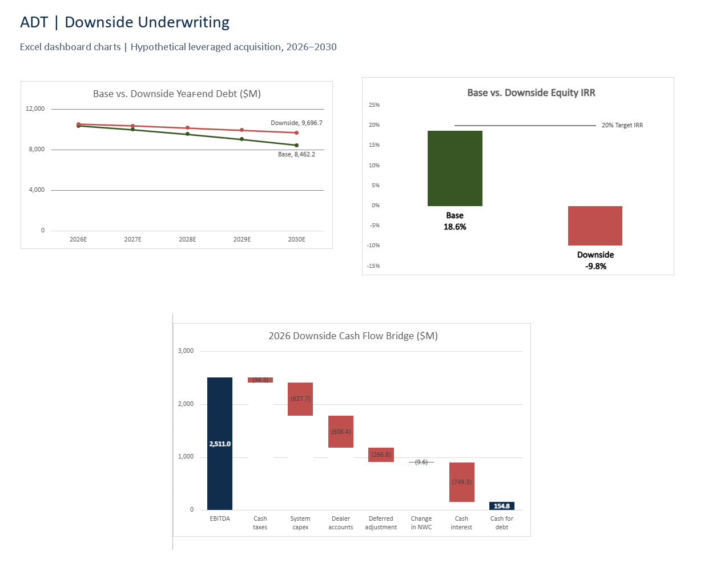

# ADT Downside Underwriting

A five-year, Excel-based analysis of a hypothetical leveraged acquisition of ADT Inc. The project tests whether the modeled purchase price and financing terms offer an attractive return under base and downside operating scenarios.

## Start here

- [Investment memo](ADT-Investment-Memo.pdf): one-page recommendation, assumptions, results, and risks.
- [Excel model](ADT-Downside-Underwriting.xlsx): editable formulas, source references, scenario calculations, and dashboard.
- [Analysis preview](analysis-preview.png): debt paydown, equity returns, and downside cash conversion.
- [Dashboard screenshot](dashboard-screenshot.png): original dashboard view. Individual chart screenshots are also included in ``.

The workbook is an `.xlsx` file. Open it in desktop Excel or upload a copy to Excel for the web. A Chrome file icon reflects the computer's file association; it does not change the workbook format. Start with Dashboard, then Scenario Comparison, Inputs, and the supporting calculations.

## Investment conclusion

**Pass at the modeled transaction terms.** Base-case equity IRR is 18.6%, below the 20.0% target. The downside produces a negative equity return and limited debt-service headroom. A lower purchase price or revised financing structure warrants further testing.

| Metric | Base | Downside |
|---|---:|---:|
| Annual revenue growth | 5.0% | 2.0% |
| EBITDA margin | 52.0% | 48.0% |
| Exit EV / EBITDA | 5.5x | 4.5x |
| Exit EBITDA ($M) | 3,403.7 | 2,718.0 |
| Exit debt ($M) | 8,462.2 | 9,696.7 |
| Sponsor exit proceeds ($M) | 10,358.1 | 2,634.0 |
| Equity MOIC | 2.3x | 0.6x |
| Annualized equity IRR | 18.6% | -9.8% |
| Minimum DSCR | 1.25x | 1.06x |

Base minimum DSCR is approximately 1.24698x: it rounds to 1.25x but is slightly below the 1.25x threshold. The downside leaves $1,234.5M more debt at exit. In 2026, $2,511.0M of downside EBITDA converts to $154.8M of cash before mandatory amortization.

## Model scope and approach

- Historical financial inputs and market references inform an illustrative 2026–2030 operating forecast.
- Transaction sources and uses assume a 5.5x entry multiple, 4.0x initial leverage, a 7.0% blended interest rate, and a 100% excess-cash sweep.
- Debt schedules link cash interest, mandatory amortization, optional repayment, ending debt, and debt-service coverage.
- Sponsor returns connect exit enterprise value, debt, cash, invested equity, MOIC, and annualized IRR.
- Parallel scenario calculations compare base and downside results. Exit sensitivity holds debt and cash fixed; it tests valuation rather than recalculating operating stress.
- The cash flow bridge includes system/equipment capex, dealer-account purchases, deferred cash-flow adjustments, working capital, cash taxes, and interest.

The workbook contains Inputs, Historical, EBITDA Bridge, Operating Model, Transaction, Debt Schedule, Returns, Downside, Dashboard, and Scenario Comparison. Source citations are retained in the workbook. Blue font denotes numeric hardcodes, green cross-sheet links, and black same-sheet calculations where the model's conventions are applied.

## Assumptions and limitations

This is an educational, hypothetical transaction analysis, not an actual acquisition or company forecast. EBITDA is defined as operating income plus depreciation and amortization and differs from company-reported Adjusted EBITDA. Simplified tax and working-capital assumptions, a blended debt rate, and a full excess-cash sweep limit financing realism. Customer-account spending and deferred adjustments materially affect conversion from EBITDA to cash. Sensitivity equity proceeds are floored at zero, so total-loss cases show -100% annualized return under the model's no-interim-distribution assumption.

AI assistance supported formula troubleshooting, presentation, and packaging. The project owner should be prepared to explain the assumptions, calculations, cash-flow adjustments, and recommendation.

## Files and verification

The packaged workbook is an unchanged copy of the newest downloaded file. The memo is preserved as downloaded. The preview combines actual Excel dashboard screenshots; full source screenshots are also included. It is not a substitute for the editable Excel dashboard. Packaging checks confirmed three chart objects, no cached Excel error cells, and a zero cash-bridge reconciliation difference. These checks do not constitute a full independent model audit. File checksums are recorded in `manifest.json`.

## Sharing

This folder is ready to upload to a GitHub repository or include in a portfolio. Keep this README at the repository root and retain the model, memo, and images folders. Use the memo and preview for a quick review; provide the workbook for detailed inspection. Nothing has been published or shared externally.

